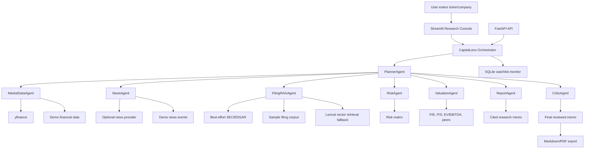

# CapitalLens AI

Autonomous financial research and productivity agent for public-company analysis.


**Built by [Sai-Vivek17](https://github.com/Sai-Vivek17).**

CapitalLens AI is a polished AI agent product that converts a company name or stock ticker into a professional, cited research memo. It combines autonomous planning, market data tools, news/event analysis, filing evidence retrieval, risk scoring, valuation context, report generation, and a watchlist monitor in a local app that can be demoed without API keys.

> This project is for research and educational purposes only. It does not provide personalized investment, legal, tax, accounting, or trading advice.

## Product Screenshot


## What It Does

CapitalLens AI helps analysts, students, founders, and finance teams research public companies quickly. A user enters a ticker such as `AAPL`, `MSFT`, `TSLA`, `RELIANCE.NS`, `TCS.NS`, or a company name like `Tesla`, chooses a research depth, and the agent produces a structured memo with cited sources.

The final output includes:

- Company overview
- Recent developments
- Financial health summary
- Key financial ratios
- Risk matrix
- Bull case and bear case
- Valuation snapshot
- Analyst-style conclusion
- Source citations
- Markdown and PDF export

## Core Features

- **Autonomous research planning:** PlannerAgent creates a task plan for each run.
- **Multi-agent architecture:** Dedicated agents for market data, news, filing RAG, risk, valuation, reporting, and critique.
- **RAG with citations:** FilingRAGAgent retrieves evidence from sample filings and best-effort SEC/EDGAR filings for supported US companies.
- **Demo mode:** Works without API keys using deterministic sample data for Apple, Microsoft, Tesla, Reliance Industries, and TCS.
- **Live-data ready:** Optional adapters for yfinance, NewsAPI-style providers, SEC/EDGAR, and OpenAI-compatible LLM memo polish.
- **Structured outputs:** Pydantic models keep every agent output typed and predictable.
- **Scoring system:** Financial Health, Risk, Momentum, and Research Confidence scores.
- **Professional UI:** Streamlit dashboard with sidebar controls, progress timeline, tabs, charts, score cards, and downloads.
- **Watchlist monitor:** SQLite-backed watchlist that flags price moves, negative news, volatility, weak trends, and risk-score changes.
- **Export workflow:** Download generated reports as Markdown or PDF.
- **Test coverage:** Unit tests for ticker validation, demo fallback, metric extraction, risk scoring, and report generation.

## Agent Architecture



## Tech Stack

| Layer | Tools |
| --- | --- |
| Frontend | Streamlit, pandas charts |
| Backend | FastAPI, Uvicorn |
| Data Models | Pydantic |
| Agents | Custom multi-agent orchestrator |
| Market Data | yfinance when available, deterministic demo fallback |
| Filing RAG | SEC/EDGAR best-effort adapter, sample filing corpus, lexical vector retrieval |
| News | Optional provider through environment variable, deterministic demo fallback |
| Storage | SQLite |
| Export | Markdown, PDF |
| Testing | pytest |

## Project Structure

```text
capital-lens-ai/
  app/
    main.py
    config.py
    agents/
      planner.py
      market_data.py
      news.py
      filing_rag.py
      risk.py
      valuation.py
      report.py
      critic.py
    tools/
      finance_tools.py
      news_tools.py
      rag_tools.py
      sec_tools.py
      export_tools.py
    schemas/
      models.py
    storage/
      database.py
    api/
      routes.py
  frontend/
    streamlit_app.py
  data/
    demo_companies.json
    sample_filings/
  docs/
    images/
      capitallens-ai-demo.png
  tests/
  reports/
  README.md
  requirements.txt
  .env.example
  run_backend.py
  run_frontend.py
```

## Quick Start

```bash
git clone https://github.com/Sai-Vivek17/capital-lens-ai.git
cd capital-lens-ai
pip install -r requirements.txt
```

Run the backend:

```bash
python run_backend.py
```

Run the Streamlit app:

```bash
streamlit run frontend/streamlit_app.py
```

The app works immediately in demo mode, even without API keys.

## Environment Variables

Create a local `.env` file or set these variables in your shell:

```bash
DEMO_MODE=true
OPENAI_API_KEY=
OPENAI_MODEL=gpt-4.1-mini
NEWS_API_KEY=
SEC_USER_AGENT=CapitalLensAI/1.0 contact@example.com
CAPITALLENS_DB_PATH=capital_lens_watchlist.db
```

`OPENAI_API_KEY` and `NEWS_API_KEY` are optional. When they are missing, CapitalLens AI uses deterministic demo responses and sample company data.

## Demo Flow

1. Open the Streamlit app.
2. Enter `AAPL`.
3. Select `Full Analyst Memo`.
4. Keep `Demo mode` enabled.
5. Click `Run Agent`.
6. Watch the progress timeline move through planner, market data, news, filing RAG, risk, valuation, report, and critic agents.
7. Review score cards, charts, risk matrix, valuation tab, and final memo.
8. Download the report as Markdown or PDF.
9. Open Watchlist Monitor.
10. Add `TSLA`, `MSFT`, or `RELIANCE.NS` and scan for alerts.

## API Usage

Start the backend:

```bash
python run_backend.py
```

Health check:

```bash
curl http://127.0.0.1:8000/health
```

Generate a research report:

```bash
curl -X POST http://127.0.0.1:8000/research \
  -H "Content-Type: application/json" \
  -d '{"query":"AAPL","mode":"Full Analyst Memo","demo_mode":true}'
```

Watchlist endpoints:

```bash
curl http://127.0.0.1:8000/watchlist
curl -X POST http://127.0.0.1:8000/watchlist/TSLA
curl -X POST http://127.0.0.1:8000/watchlist/scan
curl http://127.0.0.1:8000/watchlist/alerts
```

## Testing

```bash
pytest
```

Current verification:

```text
6 passed
```

The tests run in demo mode and do not require network access or API keys.

## Report Template

Generated memos follow a consistent analyst-style structure:

1. Executive Summary
2. Business Overview
3. Recent Developments
4. Financial Health
5. Valuation Snapshot
6. Key Risks
7. Bull Case
8. Bear Case
9. Agent Conclusion
10. Sources & Citations
11. Disclaimer

The conclusion avoids direct trading instructions and uses research-oriented language such as "requires caution", "appears resilient", or "needs further review".

## Example Demo Companies

| Ticker | Company |
| --- | --- |
| AAPL | Apple Inc. |
| MSFT | Microsoft Corporation |
| TSLA | Tesla, Inc. |
| RELIANCE.NS | Reliance Industries Limited |
| TCS.NS | Tata Consultancy Services Limited |

## Future Improvements

- Add persistent ChromaDB collections and embedding refresh jobs.
- Expand SEC ingestion to full 10-K, 10-Q, exhibits, and XBRL pipelines.
- Add richer peer auto-discovery by sector, geography, and market cap.
- Add DCF and scenario-analysis modules.
- Add scheduled watchlist runs with email or Slack alerts.
- Add source freshness scoring by field.
- Add authentication and team workspaces.

## Resume Highlights

- Built an autonomous financial research agent using FastAPI, Streamlit, Pydantic, RAG, SQLite, and structured multi-agent orchestration.
- Implemented robust demo mode with deterministic financial data, news events, filing excerpts, risk analysis, and memo generation.
- Designed a watchlist monitor that detects unusual price movement, negative news, volatility, weak trends, and risk-score changes.
- Created a professional dashboard with progress timeline, score cards, charts, risk matrix, valuation tab, final memo viewer, and Markdown/PDF exports.

## Author

**Vedakshari**  
GitHub: [github.com/vedakshari1-colab](https://github.com/vedakshari1-colab)

**Sai-Vivek17**  

GitHub: [github.com/Sai-Vivek17](https://github.com/Sai-Vivek17)

## Disclaimer

CapitalLens AI is for research and educational purposes only. It may contain errors, stale data, simplified assumptions, or incomplete source coverage. It does not provide personalized investment, legal, accounting, tax, or trading advice.

